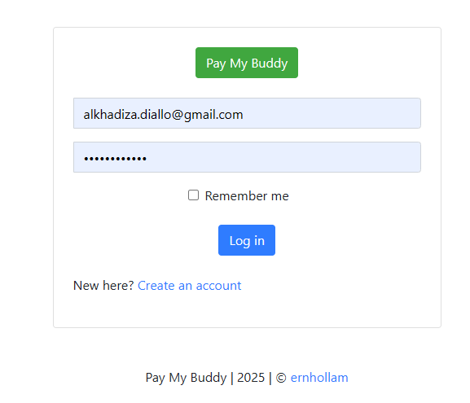

# 💸 PayMyBuddy – Application de Transactions Financières (POC Docker)

Ce dépôt présente un mini-projet de déploiement d'une application Java **Spring Boot** avec une base de données **MySQL**, orchestrés via **Docker**.  
Ce projet a été réalisé dans le cadre d’un **Bootcamp DevOps (Eazytraining)** afin d'appliquer les bonnes pratiques de conteneurisation.

---

## 🎯 Objectifs

- Conteneuriser l'application backend Spring Boot
- Déployer une base de données MySQL
- Connecter les deux services via Docker
- Automatiser et sécuriser les configurations
- Préparer une orchestration future avec Docker Compose

---

## ⚙️ Technologies utilisées

- Java 17 / Spring Boot
- MySQL 8
- Docker
- Ubuntu 20.04 (infrastructure cible)

---

## 🧱 Architecture

mini-projet-docker/ ├── backend/ │ ├── Dockerfile │ └── target/paymybuddy.jar ├── db/ │ └── initdb/ (optionnel - fichiers .sql) ├── docker-compose.yml (à venir) ├── .env (à venir) └── README.md


---

## ▶️ Exécution manuelle (sans Compose)

### 1. Builder l'image backend

```bash
cd backend
docker build -t paymybuddy-backend:v1 .

2. Lancer la base de données MySQL

docker run -d \
  --name paymybuddy-db \
  -e MYSQL_ROOT_PASSWORD=rootpass \
  -e MYSQL_DATABASE=paymybuddy \
  -e MYSQL_USER=payuser \
  -e MYSQL_PASSWORD=paypass \
  -p 3306:3306 \
  mysql:8.0
3. Lancer l'application backend

docker run -d \
  --name paymybuddy-backend \
  -p 8080:8080 \
  --link paymybuddy-db \
  -e SPRING_DATASOURCE_URL=jdbc:mysql://paymybuddy-db:3306/paymybuddy \
  -e SPRING_DATASOURCE_USERNAME=payuser \
  -e SPRING_DATASOURCE_PASSWORD=paypass \
  paymybuddy-backend:v1


Vérifier les conteneurs :docker ps
Voir les logs backend :docker logs -f paymybuddy-backend

---

## 📸 Capture d’écran – Interface de connexion



2. Compiler le projet (via Docker): docker run --rm -v "$PWD":/app -w /app maven:3.8.8-eclipse-temurin-17 mvn clean package

5. Builder et tagger l’image backend:
docker build -t paymybuddy-backend:v1 .
docker tag paymybuddy-backend:v1 localhost:5000/paymybuddy-backend:v1
 
4. Lancer le registre Docker privé:

docker run -d -p 5000:5000 --name registry-kaly registry:2

Pousser l’image dans le registre
docker push localhost:5000/paymybuddy-backend:v1

Docker Compose (backend + MySQL):docker-compose up -d

test rapide sur le terminal :curl http://localhost:8080

 Interface Docker Registry UI :
docker run -d -p 8090:80 \
  --name frontend-kaly \
  --network paymy-net \
  -e REGISTRY_URL=http://registry-kaly:5000 \
  -e REGISTRY_TITLE="PayMyBuddy Registry" \
  -e DELETE_IMAGES=true \
  -e CATALOG_ELEMENTS_LIMIT=50 \
  joxit/docker-registry-ui:1.5-static

Ouvrir [Open Port 8090] dans DockerLabs pour voir les images


